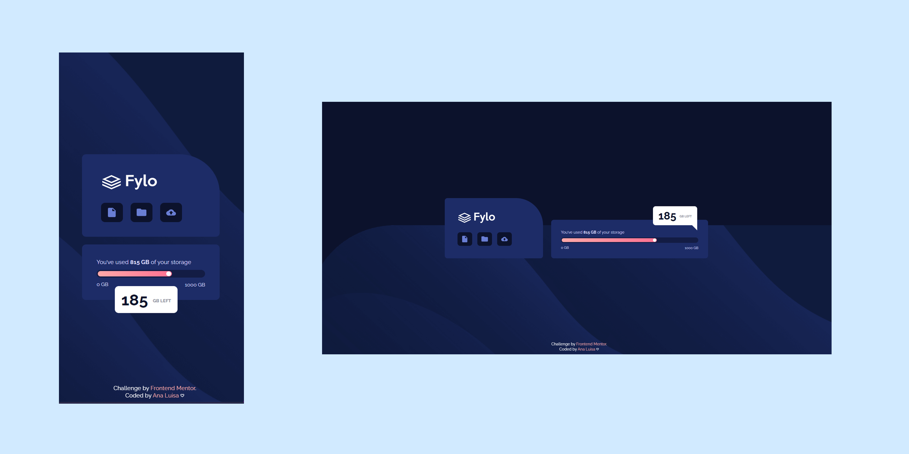

  

 
*<h1>Desafio Frontend Mentor</h1>Frontend Mentor Challenge*

*<h1>Pré-visualização</h1>Preview*

 

  <a href="https://www.frontendmentor.io/challenges/fylo-data-storage-component-1dZPRbV5n/hub" target="_blank"><strong>Página do desafio - Challenge page</strong></a>
   

  <a href="https://analuisafav.github.io/Fylo-Data/" target="_blank">Visualizar minha solução do desafio - View my challenge solution</a>

*<h1>Sobre</h1>About*

Mais um desafio no Frontend Mentor, com layout responsivo. Esse desafio foi um pouco mais difícil. Em primeiro momento, eu não estava conseguindo fazer o background (azul escuro) dos ícones todos do mesmo tamanho, pois as imagens dos ícones são de tamanhos diferentes. Então a solução que eu encontrei foi fazer uma div para cada ícone, e colocá-las como background, e fazer uma classe apenas para o background azul.
Eu nunca havia feito um balão de diálogo e uma barra de progresso, então foi algo que exigiu pesquisa 😅 mas deu certo e estou feliz com o resultado! 🥳

One more challenge on Frontend Mentor, with responsive layout. This challenge was a little more difficult. At first, I couldn't make the background (dark blue) of the icons all the same size, because the image of the icons has different sizes. So the solution I found was to make a div for each icon, and put them as the background, and make a class just for the blue background. 
I've never made a speech bubble and progress bar before, so it took some research 😅 but it worked and i'm happy with the result! 🥳

*<h1>Feito com</h1>Built with*

  

*<h1>Vamos nos conectar?</h1>Let's connect?👋*

      

